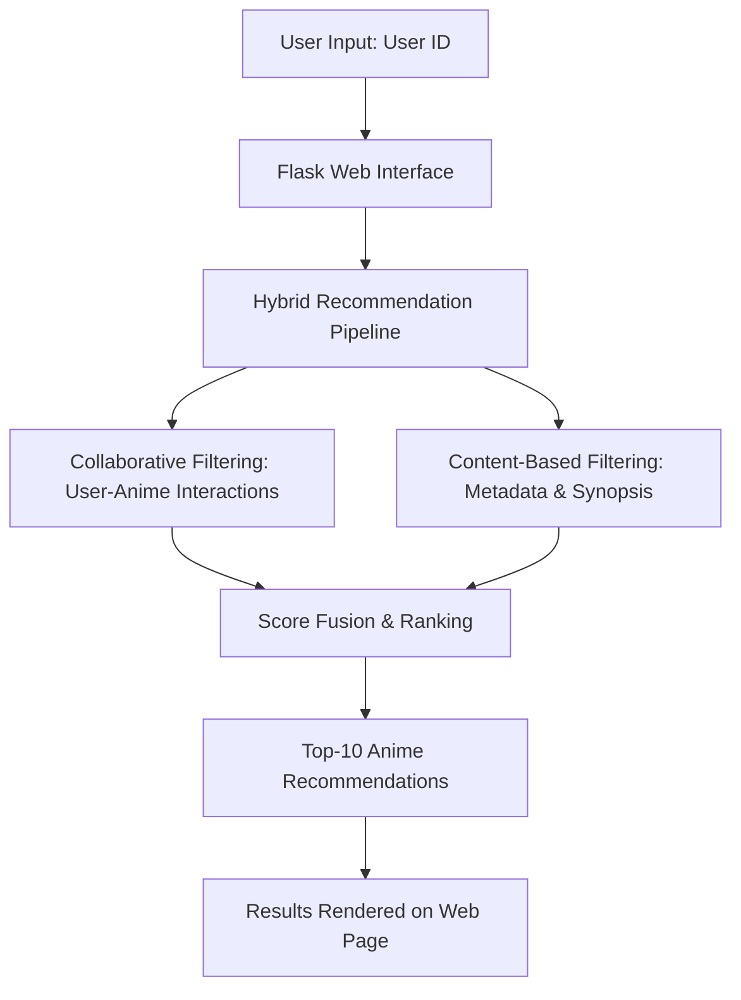
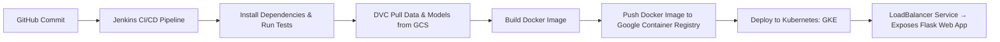

# 🎌 Anime Recommendation System (MLOps Project)

## 📌 Project Overview

This repository presents a **Hybrid Anime Recommendation System** built with **state-of-the-art Machine Learning** and **end-to-end MLOps practices**.  
The system leverages **Collaborative Filtering** and **Content-Based Filtering** to deliver **personalized anime recommendations** to users.

Unlike traditional ML projects, this solution is fully **production-ready**, integrating automation, scalability, and monitoring. It combines **ML pipelines** with **cloud-native deployment** to demonstrate **real-world engineering skills**.

🔑 **Highlights:**
- ✅ **Hybrid recommender system** (Collaborative + Content-Based)  
- ✅ **MLOps-driven workflow** (DVC, Comet ML, Jenkins, Docker, Kubernetes)  
- ✅ **Cloud-native architecture** deployed on **Google Kubernetes Engine (GKE)**  
- ✅ **Scalable, reproducible, and automated** end-to-end ML lifecycle  

---

## 🚀 Features

- 🎯 **Personalized Recommendations** → Top-10 anime suggestions per user  
- 🔄 **Hybrid Recommendation Engine** → Combines user behavior + anime metadata  
- 📦 **MLOps Integration** → Data versioning, experiment tracking, CI/CD pipelines  
- ☁️ **Cloud Deployment** → Google Cloud Storage + Kubernetes cluster (GKE)  
- 📊 **Experiment Transparency** → Metrics & embeddings logged via Comet ML  
- ⚡ **Scalability & Reliability** → Autoscaling pods, load balancing, and CI/CD  

---

## 🛠️ Tech Stack

### 🔹 Core Development
- **Python 3.8**  
- **Flask** (backend web app)  
- **TensorFlow / Keras** (deep learning models)  
- **Pandas, NumPy** (data wrangling)  

### 🔹 MLOps & DevOps
- **DVC** → Dataset & model versioning  
- **Comet ML** → Experiment tracking & visualization  
- **Docker** → Containerization for portability  
- **Kubernetes (GKE)** → Orchestration & scaling  
- **Jenkins** → CI/CD automation  
- **Google Cloud Storage (GCS)** → Artifact & dataset storage  

---

## ⚙️ System Architecture



---

## 🤖 Machine Learning Approach

### 1️⃣ Collaborative Filtering
- Learns **latent user–anime factors** from rating matrix  
- Embedding model (`RecommenderNet`) with:  
  - `user_id → user_embedding`  
  - `anime_id → anime_embedding`  
- Optimized with **binary crossentropy** for recommendation accuracy  

### 2️⃣ Content-Based Filtering
- Leverages **metadata features**: genres, synopsis, anime type, ratings  
- Computes semantic similarity between anime via embeddings  

### 3️⃣ Hybrid Model
- **Weighted combination** of collaborative and content-based predictions  
- Balances **personalization** with **content diversity**  
- Produces **ranked top-10 recommendations** per user  

---

## 🔧 MLOps Workflow

### 📈 CI/CD with Jenkins + Docker + Kubernetes



**Pipeline Stages:**  
1. **Code Integration** → GitHub → Jenkins  
2. **Data Retrieval** → DVC pulls datasets & artifacts from GCS  
3. **Containerization** → Build & push Docker image to GCR  
4. **Deployment** → Apply Kubernetes manifests (`deployment.yaml`)  
5. **Scaling** → Kubernetes HPA ensures high availability  

---

## 📊 Experiment Tracking (Comet ML)

Every experiment is logged to **Comet ML Dashboard**, including:
- 📉 Training & validation losses  
- 🧩 User & anime embeddings  
- 🔧 Hyperparameters & metrics  
- 📦 Model checkpoints  

This ensures **comparability, reproducibility, and optimization** of models.  

---

## 📂 Repository Structure

```
.
├── application.py          # Flask web app
├── pipeline/               # ML training & prediction pipelines
├── src/                    # Core ML code (data processing, models)
├── config/                 # Config files & paths
├── artifacts/              # DVC-tracked datasets & models
├── static/                 # CSS, JS & frontend assets
├── templates/              # HTML templates (Flask)
├── deployment.yaml         # Kubernetes spec
├── Dockerfile              # Docker build config
├── Jenkinsfile             # CI/CD pipeline
├── requirements.txt        # Python dependencies
└── setup.py                # Package setup
```

---

## 👨‍💻 Author

**SAMI-CODEAI**  


---
